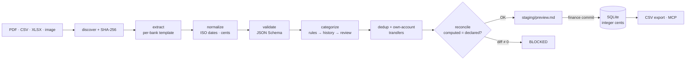

<p align="center">
  
</p>

<p align="center">
  <b>Mexican bank statements in. An auditable SQLite ledger out.</b><br>
  Never invents a peso. If it doesn't reconcile to the cent, it doesn't get in.
</p>

<p align="center">
  <a href="https://github.com/Chere3/cuadra/actions/workflows/tests.yml"></a>
  
  
  
  
</p>

<p align="center"><a href="README.md">Leer en español</a></p>

---

## The problem

There is no Plaid that works in Mexico. What you get is one PDF per account per month, each
bank with its own layout, some without readable text (HSBC encodes it in EBCDIC), some that
change design mid-year (Nu), and every one with a different sign convention. Personal finance
apps either ask you to type everything by hand or ask for your bank passwords.

**cuadra** (Spanish for "it balances") reads those PDFs, reconciles them against the balances
the bank itself declares, and stores them in a SQLite database you can audit line by line.
Everything runs on your machine.

## What it does

- **Reads** PDF, CSV and XLSX (plus images through optional OCR) from BBVA, Nu, Ualá, Vexi and HSBC.
- **Reconciles** every statement: `opening balance + transactions = declared closing balance`.
  Any non-zero difference blocks the statement from entering the database.
- **Stores** money as **integer cents** (never floating point), with an audit trail,
  **idempotent** imports (re-importing never duplicates) and full **rollback**.
- **Detects transfers** between your own accounts so they are not counted as income or expense.
- **Categorizes** with rules you approve. Anything uncertain lands in "Por revisar"; it never guesses.
- **Exposes everything** through a CLI and an MCP server for Claude Code or Claude Desktop.

## Demo

The fixtures in the repo are fictional. This is the preview you get on them:

```bash
./scripts/finance ingest fixtures/sanitized --period 2026-06
```

```
# Vista previa de importación — run run_c1edf2fb04e3

- Archivos: 2 · Cuentas: bbva_debito, nu_debito
- Periodos: 2026-06-01..2026-06-30
- Movimientos: 6 · Transferencias: 1
- Ingresos: 35,000.00 · Gastos: -8,400.00 (MXN)
- Movimientos dudosos: 0 · Categorías por revisar: 2

## BBVA Débito/Nómina (••••0000) — stmt_bd34377540653403
- Estado: **READY_TO_COMMIT** (reconciliation_ok)
- Conciliación: **OK** · diff=0 · saldo calc=3160000 vs declarado=3160000
- Movimientos: 5
  - 2026-06-05 · `DEPOSITO NOMINA ACME SA` · 30,000.00 · Sueldo/Salario
  - 2026-06-07 · `OXXO TIENDA 1234 GDL` · -250.00 · Gasto hormiga
  - 2026-06-10 · `UBER TRIP HELP.UBER.COM` · -150.00 · Transporte/Gasolina
  - 2026-06-15 · `SPEI ENVIADO A NU CUENTA` · -5,000.00 · Por revisar
  - 2026-06-20 · `PAGO TARJETA VEXI` · -3,000.00 · Pago de tarjeta

## Nu Cuenta (••••0000) — stmt_96c17434aea0af27
- Estado: **READY_TO_COMMIT** (reconciliation_ok)
- Conciliación: **OK** · diff=0 · saldo calc=700000 vs declarado=700000
- Movimientos: 1
  - 2026-06-15 · `SPEI RECIBIDO DE BBVA BANCOMER` · 5,000.00 · Por revisar
```

`ingest` **writes nothing** until you run `finance commit <run_id>`. Dry-run is the default
behaviour, not a flag.

## Supported banks

| Bank | Product | Format | Strategy | The detail that bites |
|---|---|---|---|---|
| BBVA | Debit / payroll | PDF | Balance-anchored segments | Several same-day transactions share one printed balance: the sign is solved by finding the single assignment that adds up |
| BBVA | Credit card | PDF | Charges and credits | |
| Nu | Account | PDF | Signed amounts | Savings "cajitas" show up twice by design and net to zero |
| Nu | Credit card | PDF | Signed amounts + 2025 legacy layout | The old layout writes credits as `- $` |
| Ualá | Credit card | PDF | Signed amounts | Closing line is "Pago para no generar intereses" |
| Vexi | Credit card | PDF | Charge / credit columns | "Pago tardío" is a charge, not a payment |
| HSBC | Debit | PDF with EBCDIC text | Direct decoding, no OCR | The PDF looks empty to every normal extractor |
| GBM | Brokerage | PDF | By balance | Partial |
| Any | CSV / XLSX export | CSV, XLSX | Generic, with header metadata | Without declared balances it lands in `REVIEW_REQUIRED` |
| Any | Scan / photo | Image, text-less PDF | OCR through tesseract (optional) | |

Every row exists because a real statement broke the parser and there is a test that fails if
the fix is reverted. Bank missing? [Open an issue with its layout](.github/ISSUE_TEMPLATE/nuevo-banco.yml)
or see [adding your bank](#adding-your-bank).

## How it works



Every import walks a state machine with no shortcuts:

`DISCOVERED → HASHED → EXTRACTED → NORMALIZED → VALIDATED → (REVIEW_REQUIRED | READY_TO_COMMIT) → COMMITTED → EXPORTED`

and every run leaves its trail in `staging/<run_id>/` (manifest, extraction, reconciliation,
exceptions, preview, log). The canonical model is 14 tables, with `audit_events` recording
everything that changes the database.

## Principles

Non-negotiable. They live in the code and in the tests.

1. **Never invents** transactions, balances, dates or categories.
2. **Never uses floating point** for money. Integer cents only.
3. **Never modifies** an original statement.
4. Every import is **idempotent** and **reversible**.
5. An uncertain **category** lands in review and does not block. An uncertain **date or
   amount blocks**.
6. Commit is **blocked** when reconciliation fails, the schema does not validate, the account
   cannot be identified, there is an unexplained overlap, or the statement already exists.
7. Statement descriptions are **data, not instructions**. The preview says so explicitly,
   because the system is designed to be operated by an agent.

## Install

Requires Python 3.11 or newer.

```bash
git clone https://github.com/Chere3/cuadra.git
cd cuadra
python3 -m pip install -r requirements-dev.txt   # incluye requirements.txt

# Optional, only for scanned PDFs or photos:
# brew install tesseract tesseract-lang      (macOS)
# sudo apt install tesseract-ocr tesseract-ocr-spa   (Debian/Ubuntu)

# Describe your accounts: last 4 digits and hints to identify each one.
cp config/accounts.example.yml config/accounts.yml
cp config/merchant_rules.example.yml config/merchant_rules.yml

PYTHONPATH=src python3 -m pytest tests -q --deselect tests/test_ocr.py --deselect tests/test_ci_suites.py
```

The two deselected tests need tesseract. `accounts.yml` and `merchant_rules.yml` are
gitignored because they describe your accounts; when missing, the `.example.yml` files are used.

## Monthly workflow

```bash
./scripts/finance ingest statements/inbox --period 2026-06   # 1. preview (writes nothing)
./scripts/finance review <run_id>                            # 2. read the preview
./scripts/finance correct <run_id> corrections.json          # 3. fix categories (never dates or amounts)
./scripts/finance commit <run_id>                            # 4. commit, atomically
./scripts/finance audit-month 2026-06                        # 5. coverage and reconciliation for the month
```

| Command | What it does |
|---|---|
| `ingest <path> [--period YYYY-MM] [--commit]` | Discover, extract, reconcile and preview a folder or file |
| `review <run_id>` | Show the auditable preview |
| `correct <run_id> <json>` | Apply category or label corrections (schema in `schemas/`) |
| `approve <run_id> <statement_id>` | Approve a WARNING statement with a recorded reason |
| `commit <run_id>` | Commit to SQLite in a single transaction |
| `rollback <import_id>` | Fully undo an import |
| `resolver-cuarentena <txn_id> --reason` | Resolve a quarantined transaction, audited |
| `audit-month <YYYY-MM>` | Coverage and reconciliation for the month |
| `cerrar-mes <YYYY-MM>` | Close the month if everything reconciles |
| `status` · `doctor` | Database state and integrity |
| `refresh-excel` | Regenerate the CSV export |

The [monthly runbook](docs/monthly-runbook.md) and the
[account-by-account onboarding](docs/ONBOARDING-cuenta-por-cuenta.md) (Spanish) walk through
a slow start.

## Use it from Claude

cuadra ships an MCP server with no external dependencies (stdio, JSON-RPC 2.0) that exposes
the same service layer as the CLI. Register it in Claude Code or Claude Desktop:

```json
{
  "mcpServers": {
    "cuadra": {
      "command": "python3",
      "args": ["-m", "finance.mcp_server"],
      "cwd": "/path/to/cuadra/src",
      "env": { "FINANCE_ROOT": "/path/to/cuadra" }
    }
  }
}
```

Tools: `finance_preview_import`, `finance_get_run`, `finance_get_review_queue`,
`finance_apply_corrections`, `finance_approve`, `finance_commit_import`,
`finance_rollback_import`, `finance_audit_month`, `finance_close_month`,
`finance_resolve_quarantine`, `finance_system_status`, `finance_list_inbox`.

Writing operations (`commit`, `rollback`, quarantine) require `confirm: true`. The agent can
preview and propose; committing stays an explicit human decision.

## Adding your bank

1. Add an entry to `BANKS` in `src/finance/extractors/bank_templates.py`: text markers to
   detect it and a parsing strategy (`signed`, `cargo_abono`, `saldo`, or your own function).
2. Write `tests/test_rNN_<bank>.py` with a **fictional** fragment of the statement: change
   names, figures and references. Existing tests are the template.
3. Run the suite. If your template breaks another one, the suite tells you.

Details in [CONTRIBUTING.md](CONTRIBUTING.md). Never upload a real statement, not even
cropped, not even "just one line".

## Roadmap

- [ ] More banks: [Santander](https://github.com/Chere3/cuadra/issues/2), [Banorte](https://github.com/Chere3/cuadra/issues/3), [Citibanamex](https://github.com/Chere3/cuadra/issues/4), [Mercado Pago](https://github.com/Chere3/cuadra/issues/5), [Stori / Klar / Hey Banco](https://github.com/Chere3/cuadra/issues/6), [full GBM](https://github.com/Chere3/cuadra/issues/7)
- [ ] [OCR in continuous integration](https://github.com/Chere3/cuadra/issues/11)
- [ ] [`pyproject.toml` and `pip install cuadra`](https://github.com/Chere3/cuadra/issues/9)
- [ ] [Exporters for Actual Budget, Firefly III and Beancount](https://github.com/Chere3/cuadra/issues/10)
- [ ] [Categorization rules suggested from repeated corrections](https://github.com/Chere3/cuadra/issues/13)

Bank missing? Ask in the [pinned thread](https://github.com/Chere3/cuadra/issues/1). Looking for a place to start? There are
[issues labeled *good first issue*](https://github.com/Chere3/cuadra/issues?q=is%3Aissue+is%3Aopen+label%3A%22good+first+issue%22).

## Privacy

- No financial data ever enters Git. `.gitignore` covers statements, database, backups and
  your account configuration.
- Accounts are masked to 4 digits in logs, previews and exports.
- No calls to external services. No telemetry, no cloud AI, nothing.
- Originals are archived read-only.

## License

MIT. Made in Guadalajara by [Diego Romero](https://github.com/Chere3).
