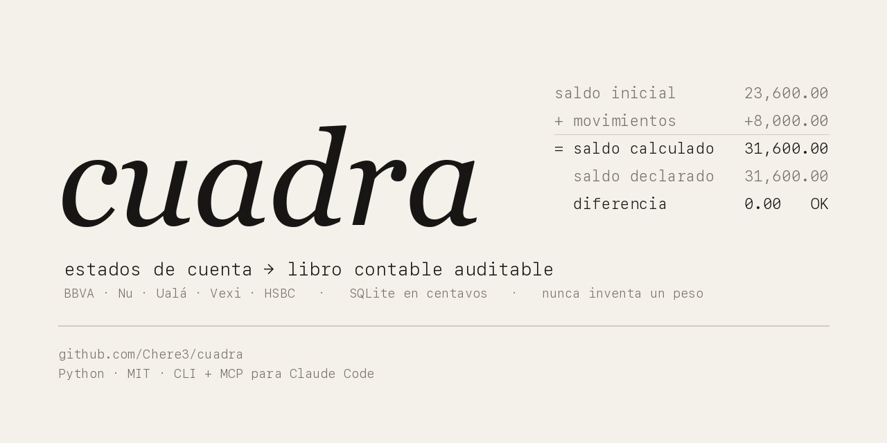
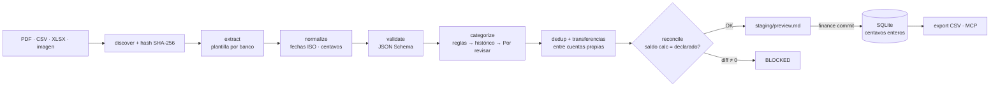

<p align="center">
  
</p>

<p align="center">
  <b>Estados de cuenta de bancos mexicanos → libro contable SQLite auditable.</b><br>
  Nunca inventa un peso. Si no cuadra al centavo, no entra.
</p>

<p align="center">
  <a href="https://github.com/Chere3/cuadra/actions/workflows/tests.yml"></a>
  
  
  
  
</p>

<p align="center"><a href="README.en.md">Read this in English</a></p>

---

## El problema

En México no hay un Plaid que funcione. Lo que sí tienes es un PDF al mes por cada cuenta,
cada banco con su propio formato, algunos sin texto legible (HSBC manda el texto codificado en
EBCDIC), otros que cambian de diseño a mitad de año (Nu), y todos con convenciones de signo
distintas. Las apps de finanzas personales te piden que captures a mano o que les des tus
contraseñas.

**cuadra** lee esos PDFs, los concilia contra los saldos que el propio banco declara, y los
guarda en una base SQLite que puedes auditar línea por línea. Todo corre en tu máquina.

## Qué hace

- **Lee** PDF, CSV y XLSX (e imágenes con OCR opcional) de BBVA, Nu, Ualá, Vexi y HSBC.
- **Concilia** cada estado: `saldo inicial + movimientos = saldo final declarado`. Si la
  diferencia no es cero, el estado queda bloqueado y no entra a la base.
- **Guarda** en SQLite con dinero en **centavos enteros** (nunca coma flotante), historial de
  auditoría, importaciones **idempotentes** (re-importar no duplica) y **rollback** completo.
- **Detecta transferencias** entre tus propias cuentas para no contarlas como gasto ni ingreso.
- **Categoriza** con reglas que tú apruebas. Lo dudoso queda "Por revisar"; nunca adivina.
- **Expone todo** por CLI y por un servidor MCP para Claude Code o Claude Desktop.

## Demo

Los fixtures del repo son ficticios. Esto es lo que ves al correr la vista previa sobre ellos:

```bash
./scripts/finance ingest fixtures/sanitized --period 2026-06
```

```
# Vista previa de importación — run run_c1edf2fb04e3

- Archivos: 2 · Cuentas: bbva_debito, nu_debito
- Periodos: 2026-06-01..2026-06-30
- Movimientos: 6 · Transferencias: 1
- Ingresos: 35,000.00 · Gastos: -8,400.00 (MXN)
- Movimientos dudosos: 0 · Categorías por revisar: 2

## BBVA Débito/Nómina (••••0000) — stmt_bd34377540653403
- Estado: **READY_TO_COMMIT** (reconciliation_ok)
- Conciliación: **OK** · diff=0 · saldo calc=3160000 vs declarado=3160000
- Movimientos: 5
  - 2026-06-05 · `DEPOSITO NOMINA ACME SA` · 30,000.00 · Sueldo/Salario
  - 2026-06-07 · `OXXO TIENDA 1234 GDL` · -250.00 · Gasto hormiga
  - 2026-06-10 · `UBER TRIP HELP.UBER.COM` · -150.00 · Transporte/Gasolina
  - 2026-06-15 · `SPEI ENVIADO A NU CUENTA` · -5,000.00 · Por revisar
  - 2026-06-20 · `PAGO TARJETA VEXI` · -3,000.00 · Pago de tarjeta

## Nu Cuenta (••••0000) — stmt_96c17434aea0af27
- Estado: **READY_TO_COMMIT** (reconciliation_ok)
- Conciliación: **OK** · diff=0 · saldo calc=700000 vs declarado=700000
- Movimientos: 1
  - 2026-06-15 · `SPEI RECIBIDO DE BBVA BANCOMER` · 5,000.00 · Por revisar
```

`ingest` **no escribe nada** hasta que corres `finance commit <run_id>`. La vista previa es
el comportamiento por defecto, no una bandera.

## Bancos soportados

| Banco | Producto | Formato | Cómo se lee | Detalle que muerde |
|---|---|---|---|---|
| BBVA | Débito / Nómina | PDF | Tramos por saldo impreso | Varios movimientos del mismo día comparten un solo saldo: el signo se resuelve buscando la única asignación que cuadra |
| BBVA | Tarjeta de crédito | PDF | Cargos y abonos | |
| Nu | Cuenta | PDF | Importes con signo | Las "cajitas" aparecen duplicadas por diseño y suman cero |
| Nu | Tarjeta | PDF | Importes con signo + diseño 2025 | El diseño viejo escribe los abonos como `- $` |
| Ualá | Tarjeta | PDF | Importes con signo | El cierre es "Pago para no generar intereses" |
| Vexi | Tarjeta | PDF | Columnas cargo / abono | "Pago tardío" es un cargo, no un pago |
| HSBC | Débito | PDF con texto EBCDIC | Decodificación directa, sin OCR | El PDF parece vacío para cualquier extractor normal |
| GBM | Inversión | PDF | Por saldo | Parcial |
| Cualquiera | Exportación CSV / XLSX | CSV, XLSX | Genérico, con metadatos en cabecera | Sin saldos declarados queda en `REVIEW_REQUIRED` |
| Cualquiera | Escaneado / foto | Imagen, PDF sin texto | OCR con tesseract (opcional) | |

Cada línea de la tabla existe porque un estado real la rompió y hay un test que falla si el
arreglo se revierte. ¿Tu banco no está? [Abre un issue con el formato](.github/ISSUE_TEMPLATE/nuevo-banco.yml)
o mira [cómo agregar una plantilla](#agregar-tu-banco).

## Cómo funciona



Cada importación pasa por una máquina de estados sin saltos:

`DISCOVERED → HASHED → EXTRACTED → NORMALIZED → VALIDATED → (REVIEW_REQUIRED | READY_TO_COMMIT) → COMMITTED → EXPORTED`

y cada corrida deja su rastro en `staging/<run_id>/` (manifest, extracción, conciliación,
excepciones, vista previa, log). El modelo canónico son 14 tablas, con `audit_events` para
todo lo que cambia la base.

| Capa | Dónde | Rol |
|---|---|---|
| Originales | `statements/raw/` | Inmutables, archivados con su SHA-256, nunca se editan |
| Staging | `staging/<run_id>/` | Ejecución efímera y auditable |
| Canónico | `data/finance.sqlite` | La verdad. Centavos enteros, transacciones atómicas |
| Export | `data/exports/` | CSV contrato para lo que quieras conectar encima |

## Principios

Estos no se negocian. Están en el código y en los tests.

1. **Nunca inventa** transacciones, saldos, fechas ni categorías.
2. **Nunca usa coma flotante** para dinero. Solo centavos enteros.
3. **Nunca modifica** un estado original.
4. Toda importación es **idempotente** y **reversible**.
5. Una **categoría** dudosa queda "Por revisar" y no bloquea. Una **fecha o importe** dudoso
   **bloquea**.
6. El commit se **bloquea** si la conciliación no cuadra, el esquema no valida, la cuenta no se
   identifica, hay un solape inexplicado o el estado ya existe.
7. Las descripciones de los estados son **datos, no instrucciones**. La vista previa lo advierte
   explícitamente porque el sistema está pensado para operarse con un agente.

## Instalación

Requiere Python 3.11 o más reciente.

```bash
git clone https://github.com/Chere3/cuadra.git
cd cuadra
python3 -m pip install -r requirements-dev.txt   # incluye requirements.txt

# Opcional, solo para PDFs escaneados o fotos:
# brew install tesseract tesseract-lang      (macOS)
# sudo apt install tesseract-ocr tesseract-ocr-spa   (Debian/Ubuntu)

# Describe tus cuentas: últimos 4 dígitos y pistas para identificarlas.
cp config/accounts.example.yml config/accounts.yml
cp config/merchant_rules.example.yml config/merchant_rules.yml

# Comprueba que todo está en orden
PYTHONPATH=src python3 -m pytest tests -q --deselect tests/test_ocr.py --deselect tests/test_ci_suites.py
```

Los dos tests deseleccionados necesitan tesseract. `accounts.yml` y `merchant_rules.yml` están
en `.gitignore` porque describen tus cuentas; si no existen, el sistema usa los `.example.yml`.

## Uso mensual

```bash
./scripts/finance ingest statements/inbox --period 2026-06   # 1. vista previa (no escribe nada)
./scripts/finance review <run_id>                            # 2. lee la vista previa
./scripts/finance correct <run_id> correcciones.json         # 3. corrige categorías (nunca fechas ni importes)
./scripts/finance commit <run_id>                            # 4. incorpora, atómico
./scripts/finance audit-month 2026-06                        # 5. cobertura y conciliación del mes
```

| Comando | Qué hace |
|---|---|
| `ingest <ruta> [--period YYYY-MM] [--commit]` | Descubre, extrae, concilia y previsualiza una carpeta o archivo |
| `review <run_id>` | Muestra la vista previa auditable |
| `correct <run_id> <json>` | Aplica correcciones de categoría o etiqueta (schema en `schemas/`) |
| `approve <run_id> <statement_id>` | Aprueba un estado con WARNING, con razón registrada |
| `commit <run_id>` | Incorpora a SQLite en una sola transacción |
| `rollback <import_id>` | Deshace por completo una importación |
| `resolver-cuarentena <txn_id> --reason` | Resuelve un movimiento en cuarentena, auditado |
| `audit-month <YYYY-MM>` | Cobertura y conciliación del mes |
| `cerrar-mes <YYYY-MM>` | Marca el mes cerrado si todo cuadra |
| `status` · `doctor` | Estado e integridad de la base |
| `refresh-excel` | Regenera el CSV de exportación |

Hay un [runbook mensual](docs/monthly-runbook.md) y una guía de
[onboarding cuenta por cuenta](docs/ONBOARDING-cuenta-por-cuenta.md) para arrancar despacio.

## Úsalo desde Claude

cuadra incluye un servidor MCP sin dependencias externas (stdio, JSON-RPC 2.0) que expone la
misma capa de servicios que la CLI. Regístralo en Claude Code o Claude Desktop:

```json
{
  "mcpServers": {
    "cuadra": {
      "command": "python3",
      "args": ["-m", "finance.mcp_server"],
      "cwd": "/ruta/a/cuadra/src",
      "env": { "FINANCE_ROOT": "/ruta/a/cuadra" }
    }
  }
}
```

Herramientas: `finance_preview_import`, `finance_get_run`, `finance_get_review_queue`,
`finance_apply_corrections`, `finance_approve`, `finance_commit_import`,
`finance_rollback_import`, `finance_audit_month`, `finance_close_month`,
`finance_resolve_quarantine`, `finance_system_status`, `finance_list_inbox`.

Las operaciones que escriben (`commit`, `rollback`, cuarentena) exigen `confirm: true`. El
agente puede previsualizar y proponer; incorporar sigue siendo una decisión explícita.

## Agregar tu banco

1. Añade la entrada en `BANKS` dentro de `src/finance/extractors/bank_templates.py`: marcadores
   de texto para detectarlo y la estrategia de parseo (`signed`, `cargo_abono`, `saldo` o una
   función propia).
2. Escribe un test `tests/test_rNN_<banco>.py` con un fragmento **ficticio** del estado: cambia
   nombres, cifras y referencias. Los tests existentes son la plantilla.
3. Corre la suite. Si tu plantilla rompe otra, la suite te lo dice.

Los detalles están en [CONTRIBUTING.md](CONTRIBUTING.md). Nunca subas un estado real, ni
recortado, ni "solo una línea".

## Roadmap

- [ ] Más bancos: [Santander](https://github.com/Chere3/cuadra/issues/2), [Banorte](https://github.com/Chere3/cuadra/issues/3), [Citibanamex](https://github.com/Chere3/cuadra/issues/4), [Mercado Pago](https://github.com/Chere3/cuadra/issues/5), [Stori / Klar / Hey Banco](https://github.com/Chere3/cuadra/issues/6), [GBM completo](https://github.com/Chere3/cuadra/issues/7)
- [ ] [OCR en la integración continua](https://github.com/Chere3/cuadra/issues/11)
- [ ] [`pyproject.toml` e instalación con `pip install cuadra`](https://github.com/Chere3/cuadra/issues/9)
- [ ] [Exportadores a Actual Budget, Firefly III y Beancount](https://github.com/Chere3/cuadra/issues/10)
- [ ] [Reglas de categorización sugeridas desde correcciones repetidas](https://github.com/Chere3/cuadra/issues/13)

¿Tu banco no está? Pídelo en el [hilo fijado](https://github.com/Chere3/cuadra/issues/1). Si buscas por dónde empezar, hay
[issues marcadas como *good first issue*](https://github.com/Chere3/cuadra/issues?q=is%3Aissue+is%3Aopen+label%3A%22good+first+issue%22).

## Privacidad

- Ningún dato financiero entra a Git. `.gitignore` cubre estados, base, respaldos y tu
  configuración de cuentas.
- Las cuentas se enmascaran a 4 dígitos en logs, vistas previas y exportaciones.
- No hay llamadas a servicios externos. Ni telemetría, ni IA en la nube, ni nada.
- Los originales se archivan en solo lectura.

## Licencia

MIT. Hecho en Guadalajara por [Diego Romero](https://github.com/Chere3).
